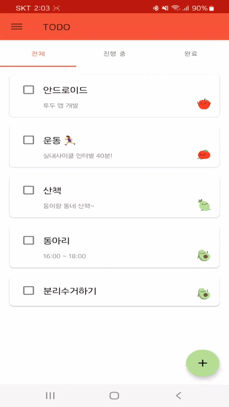

## Tomatodo
공부한 것을 실제로 적용하기 위해 시작한 개인 프로젝트입니다. 틈틈이 개발하고 있습니다.

### Tech Stack
`Kotlin` `Jetpack` `AAC` `Coroutine` `DataBinding` `ViewModel` `LiveData` `Room` `Navigation`

### 완료된 기능
- [x] 할 일 추가 / 삭제 / 수정
- [x] 할 일 체크박스
- [x] 전체 / 진행 중 / 완료 필터링

